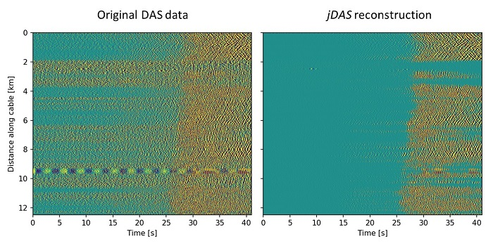
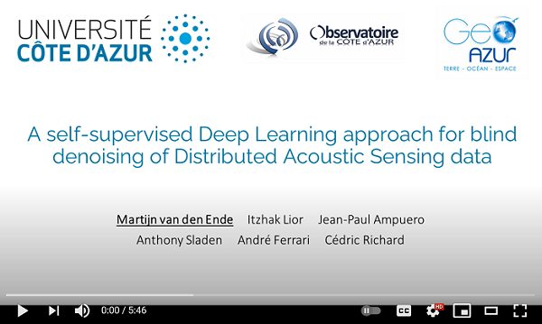

<p align="center">
    
</p>

<p align="center">
    <center><h1>Deep Learning denoising of DAS data</h1></center>
</p>

<p align="center">
    <a href="https://jdas.readthedocs.io/en/latest/?badge=latest">
        
    </a>
</p>

--------------

Contents: [overview](#overview) | [example](#example) | [quickstart](#quickstart) | [5-minute explainer video](#explainer-video) | [citing _jDAS_](#citing-jdas)
    
--------------

## Overview

_jDAS_ is a self-supervised Deep Learning model for denoising of Distributed Acoustic Sensing (DAS) data. The principle that underlies _jDAS_ is that spatio-temporally coherent signals can be interpolated, while incoherent noise cannot. Leveraging the framework laid out by Batson & Royer ([2019; ICML](http://arxiv.org/abs/1901.11365)), _jDAS_ predicts the recordings made at a target channel using the target's surrounding channels. As such, it is a self-supervised method that does not require "clean" (noise-free) waveforms as labels. 

Retraining the model on new data is quick and easy, and will produce an optimal separation between coherent signals and incoherent noise for your specific dataset:
```
from jDAS import JDAS
jdas = JDAS()
data_loader = jdas.init_dataloader(data)
model = jdas.load_model()
model.fit(data_loader, epochs=50)
```
Denoising your data is then done through a single function call:
```
clean_data = JDAS.denoise(data)
```
That's all!

For a more detailed description of the methods, see the [documentation](https://jdas.readthedocs.io/). In-depth examples on *jDAS* denoising and retraining are provided in the `examples` directory.

--------------

## Example

The example below is taken from a submarine DAS experiment conducted offshore Greece. At around 25 seconds and earthquake hits the DAS cable and induces a spatio-temporally coherent strain field. _jDAS_ removes the incoherent background noise while keeping the earthquake signals.

<p align="center">
    
</p>

Note that some aliasing artifacts have been introduced in rendering this static JPEG. A code example to reproduce this figure is included in the `examples` directory of the project.

--------------

## Quickstart

_jDAS_ depends on the following Python libraries:

- [TensorFlow](https://www.tensorflow.org/) (`>= 2.2.0`): while training and inference is much faster on a GPU, the CPU version of TensorFlow is sufficient in case problems arise installing the CUDA dependencies.
- [NumPy](https://numpy.org/) and [SciPy](https://scipy.org/) for numerical manipulations.
- [Matplotlib](https://matplotlib.org/) for visualisation.
- [h5py](https://www.h5py.org/) for IO.
- (Optional) [Jupyter](https://jupyter.org/) notebook or lab to run the examples

All of these dependencies can be installed with [Anaconda](https://www.anaconda.com/products/individual):
```
conda install -c conda-forge numpy scipy matplotlib h5py "tensorflow-gpu>=2.2.0"
```

To obtain the _jDAS_ source code, you can pull it directly from the GitHub repository:
```
git clone https://github.com/martijnende/jDAS.git
```
No additional building is required. To test the installation, try running one of the examples Jupyter notebooks in the `examples` directory.

Please open a ticket under the tab "Issues" on the GitHub repository if you have trouble setting-up _jDAS_.

--------------

## Explainer video

<p align="center">
    <a href="https://youtu.be/9NNElFOIzK8">
        
    </a>
</p>

--------------

## Citing _jDAS_

For use of _jDAS_ in scientific applications, please consider citing the following peer-reviewed publication:

```
@article{vandenEnde2021,
    author={van den Ende, Martijn Peter Anton and Lior, Itzhak and Ampuero, Jean-Paul and Sladen, Anthony and Ferrari, André and Richard, Cédric},
    title={A Self-Supervised Deep Learning Approach for Blind Denoising and Waveform Coherence Enhancement in Distributed Acoustic Sensing Data}, 
    publisher={IEEE Transactions on Neural Networks and Learning Systems}, doi={10.31223/X55K63}, year={2021}, volume={0}
}
```

An identical preprint is available from EarthArxiv: https://eartharxiv.org/repository/view/2136/
