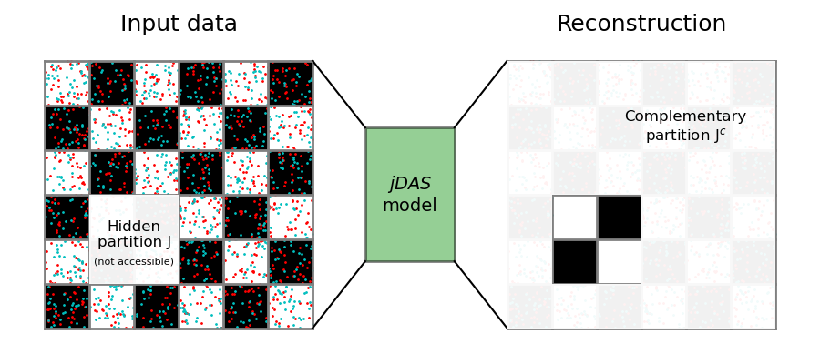
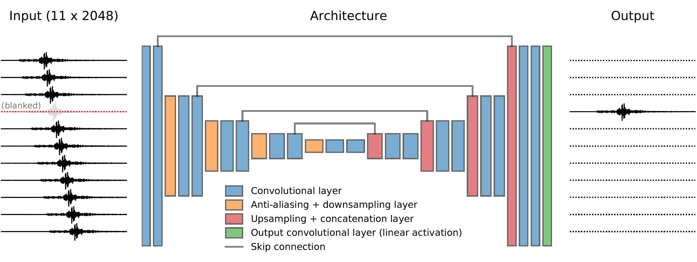

Technical details
-----------------

This section describes first qualitatively, then quantitatively, the underlying principles of *jDAS*. These descriptions are an interpretation of the framework laid out by Batson & Royer (`2019; ICML <http://arxiv.org/abs/1901.11365>`_), who developed a detailed and thorough body of theory with additional proofs and numerical demonstrations. In this section we will restrict ourselves to the application of :math:`J`-invariance in Deep Learning.

Qualitative description
=======================

Consider an example of a checkerboard. If someone were to cover a part of the checkerboard with a piece of paper, you would still be able to predict the pattern that is hidden by the paper with great accuracy. This is because the checkerboard pattern exhibits long-range correlations that can be used for interpolation (and extrapolation). On the other hand, if someone were to introduce a random speckle pattern onto the checkerboard, the details of the speckle pattern underneath the cover paper cannot be predicted; the speckle pattern exhibits no spatial correlations, and an observation of the speckles at one location cannot be used to inform predictions about a different location.

.. _concept-figure:

    
    Fig. 1: concept of :math:`J`-invariance underlying *jDAS*

This notion that long-range correlations can be interpolated, while short-range correlations cannot, is what drives *jDAS*. Imagine that you'd be given a checkerboard sprayed with a black-and-white speckle pattern (for clarity shown in red and cyan in Fig. 1), but that a few tiles are missing. You are then tasked to reconstruct those tiles as accurately as possible. Aside from reconstructing the missing tiles, you could decide to add a self-made speckle pattern on top. But because you don't know *exactly* which speckle goes where, you will likely never guess all the speckles correctly. The best you can do to reconstruct the missing tiles is to estimate the *average* of the speckles, which is zero if you assume that black and white speckles cancel each other out. Hence, your reconstruction will be informed by the long-range patterns on the checkerboard, but does not include all of the individual speckles. If you now repeat this procedure for different parts of the checkerboard, reconstructing a few tiles at a time, you end up with a reconstruction with no speckle noise.

A similar idea underlies the *jDAS* filtering approach. Given some DAS data with a spatial and a temporal component, a Deep Learning model can learn to extract correlated patterns in the data, and use those to interpolate gaps in the data. If we create a gap in the data and ask the *jDAS* model to predict what is inside the gap, and systematically repeat this procedure such that all the data points are "gapped" once, we can collect the Deep Learning predictions for each gap, and put them together to make a noise-free reconstruction of the DAS data. And note that this procedure is entirely based on the presence (or absence) or coherent patterns; we do not need to know *a-priori* what the noise-free data actually look like. This renders *jDAS* a so-called "self-supervised" Deep Learning method. The main advantage over "supervised" methods (for which you need to know what the clean data look like) is that you can easily retrain the model on new data (for instance: a new DAS experiment in a different location).

Quantitative description
========================

To make the above description more quantitative and precise, define a feature-space partition :math:`J`. In the case of an image, the feature-space is defined by the pixels, so :math:`J` would represent a patch of pixels. The values of the pixels in :math:`J` are collectively denoted by :math:`x_J`. Let's now define some function :math:`f: x \rightarrow y`, which takes :math:`x` as an argument and produces some output :math:`y`. We say that this function is :math:`J`-invariant if :math:`f(x)_J = y_J` does not depend on :math:`x_J`.

To bring this definition back to the example of the checkerboard, the colour of the tiles (including the speckles) at a given location is denoted by :math:`x`, and we hide a part of the checkerboard under a piece of paper (the partition :math:`J`). We then give :math:`x` to a function :math:`f` that produces a reconstruction of the input, :math:`y`. But as we've seen above, to make this reconstruction we do not necessarily need to see what is underneath the paper (:math:`x_J`) in order to make a good reconstruction (:math:`y_J`). We can therefore say that interpolating the checkerboard patterns is a :math:`J`-invariant operation.

It would of course be a trivial exercise to predict :math:`y_J` if we had direct access to :math:`x_J`, which is basically the identity operation. In order to efficiently train a Deep Learning model to *not* learn the identity operation, we need to restrict the input of our model to the complement of :math:`J`, denoted by :math:`J^c`. In that way, the Deep Learning model needs to use the surroundings of :math:`x_J` to predict :math:`y_J`. Practically this is achieved through a masking operation :math:`\Pi_J(x)`, which sets all the values of :math:`x` outside of :math:`J` to zero. 

As opposed to the original procedure adopted by Batson & Royer (2019), we train our Deep Learning model on batches of data, sampled from a larger dataset, and we try to optimise the model parameters by averaging the performance over an entire batch :math:`K`. Let :math:`f(\cdot | \theta)` denote the Deep Learning model parametrised by :math:`\theta`. The model input for the :math:`k`-th sample (:math:`k \in K`) is then :math:`u_k := \Pi_{J^c_k} \left( x_k \right)`, and its output is :math:`v_k := \Pi_{J_k} \left( f (u_k | \theta) \right)`. The training objective is then defined as:

.. math::

    \hat{\theta} = \arg \min \frac{1}{|K|} \sum_{k \in K} || v_k - \Pi_{J_k} \left(x_k \right)||^2

While this precise training objective is a bit heavy on the notation, it says nothing more but "*find the model parameters* :math:`\theta` *that minimise the mean squared difference between* :math:`x_J` *and the prediction* :math:`y_J`*, without seeing* :math:`x_J` *directly*".

Model architecture
==================

To describe the *jDAS* model architecture, we will need to (slightly) move away from the checkerboard analogy, in which the length scale of the correlations was the same along each dimension. In DAS data, however, the two dimensions represent time and space, and the correlations of interest have different wavelengths in each dimension. So instead of applying a square patch like in Fig. 1, we mask one waveform recorded at a random DAS channel by setting it to zero ("blanking"). The blanked DAS channel defines the partition :math:`J`, and so the target for the model is to predict the waveform in :math:`J` using only the neighbouring DAS channels (:math:`J^c`). In total we use a set of 11 consecutive channels, each 2048 time samples in length. The pretrained model provided in the GitHub repository was trained at a 50 Hz sampling rate, so 2048 samples corresponds to roughly 41 seconds in time.

    
    Fig. 2: *jDAS* model architecture
    
The Deep Learning model is based on the U-Net architecture (Ronneberger *et al.*, `2015; MICCAI <http://arxiv.org/abs/1505.04597>`_), and features a number of convolutional layers followed by anti-aliasing and resampling layers, as well as the skip connections that are the hallmark of U-Nets. Empirically we found that anti-aliasing before downsampling improves the model performance, possibly because the progressive downsampling brings equivalent Nyquist frequency way below the data frequency band (1-10 Hz). See Zhang (`2019; ICML <http://arxiv.org/abs/1904.11486>`_) for a detailed exhibition of internal anti-aliasing.
