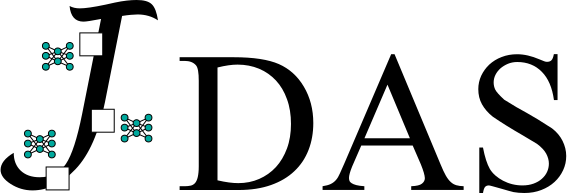

.. jDAS documentation master file, created by
   sphinx-quickstart on Sat Aug 21 15:42:30 2021.
   You can adapt this file completely to your liking, but it should at least
   contain the root `toctree` directive.

|

*jDAS* in a nutshell
--------------------

*jDAS* is a self-supervised Deep Learning model for denoising of Distributed Acoustic Sensing (DAS) data. The principle that underlies *jDAS* is that spatio-temporally coherent signals can be interpolated, while incoherent noise cannot. Leveraging the framework laid out by Batson & Royer (`2019; ICML <http://arxiv.org/abs/1901.11365>`_), *jDAS* predicts the recordings made at a target channel using the target's surrounding channels. As such, it is a self-supervised method that does not require "clean" (noise-free) waveforms as labels. 

Retraining the model on new data is quick and easy, and will produce an optimal separation between coherent signals and incoherent noise for your specific dataset::
    
    from jDAS import JDAS
    jdas = JDAS()
    data_loader = jdas.init_dataloader(data)
    model = jdas.load_model()
    model.fit(data_loader, epochs=50)
    
Denoising your data is then done through a single function call::

    clean_data = jdas.denoise(data)
    
That's all!

Example
-------

The example below is taken from a submarine DAS experiment conducted offshore Greece. At around 25 seconds and earthquake hits the DAS cable and induces a spatio-temporally coherent strain field. *jDAS* removes the incoherent background noise while keeping the earthquake signals.

.. image:: img/jDAS_example.jpg

Note that some aliasing artifacts have been introduced in rendering this static JPEG. A code example to reproduce this figure is included in the ``examples`` directory of the project.

Contents
--------
.. toctree::
    :numbered:
    :maxdepth: 2
    
    installation.rst
    inference.rst
    training.rst
    details.rst
    resources.rst
    license.rst
    reference.rst

